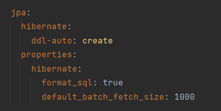

## 엔티티 설계 전략

## 엔티티 설계시 주의점

1. 엔티티에는 가급적 Setter를 사용하지 말자

   - 유지보수가 어렵다.
   - 변경할 수 있는 여지가 많다.

2. 모든 연관관계는 지연로딩으로 설정한다.

   - N+1 문제가 발생할 수 있다.

     ### N+1 문제

     연관관계가 설정된 엔티티를 조회할 경우 조회된 데이터 개수만큼 연관관계의 조회 쿼리가 추가로 발생하는 현상
     
     ### N+1 테스트 코드
     
     
     
     ### 발생 이유
     
     - JPA Repository로 find시 실행하는 첫 쿼리에서 하위 엔티티까지 한번에 가져오지 않고, 하위 엔티티를 사용할 때 추가로 가져오기 때문에
     - JPQL은 기본적으로 글로벌 fetch 전략을 무시하고 오직 JPQL 자체를 사용하기 때문에
     
     1. Fetch = FetchType.EAGER
     
        동작 순서
     
        1. select t from Team t라는 JPQL 구문이 생성되고 해당 구문을 select * from Team이라는 SQL 구문으로 실행한다.
        2. DB의 결과를 받아 team 엔티티 인스턴스를 생성한다.
        3. 이 때 team과 연관되어 있는 member도 같이 로딩된다.
        4. 영속성 컨텍스트에 연관된 member가 있는 지 확인한다.
        5. 영속성 컨텍스트에 없다면 조회된 team 개수만큼 select * from Member where team_id = ? SQL 구문이 생성된다. (N + 1)
     
     2. Fetch = FetchType.LAZY
     
        동작 순서
     
        1~2: 위와 동일함.
     
        3: 코드에서 team의 member객체를 사용하려고 하는 시점에 영속성 컨텍스트에서 연관된 member가 있는 지 확인한다.
     
        4: 영속성 컨텍스트에 없다면 조회된 team 개수만큼 select * from Member where team_id = ? SQL 구문이 생성된다. (N + 1)
     
     ### N+1 해결방법
     
     1. Fetch Join 사용
     
        N+1이 발생하는 이유는 한쪽 테이블만 조회하고 연결되어 있는 다른 테이블을 따로 조회하기 때문이다. 그렇기 때문에 미리 두 테이블을 조인하여 한번에 모든 데이터를 가져올 수 있다면 N+1문제를 방지할 수 있다.
     
        
     
        [실행 결과]
     
        
     
        
     
     2. Batch Size
     
        이 옵션은 정확히는 N+1 문제를 안 일어나게 하는 방법은 아니고, N+1 문제가 발생하더라도 in Query 방식으로 N+1 문제가 발생하게 하는 방법이다.
     
        
     
        [실행 결과]
     
        
     
        

3. 컬렉션은 필드에서 초기화하자.

   - Null Pointer Exception을 방지 할 수 있다.
   - 엔티티가 영속화될 때 하이버네이트가 내부에 컬렉션이 있는 경우 컬렉션을 조작할 수 있는 형태로 변경하게 되는 데, 개발자가 나중에 임의로 초기화를 하게 된다면,  컬렉션 타입이 변경되서 하이버네이트가 정상 동작하지 않게 된다. 그렇기 때문에  필드에서 컬렉션을 초기화하고, 임의로 컬렉션을 바꾸지 못하게 하도록 코드를 작성해야 한다

## 참고

- [실전! 스프링부트와 JPA 활용1 - 웹 애플리케이션 개발](https://www.inflearn.com/course/%EC%8A%A4%ED%94%84%EB%A7%81%EB%B6%80%ED%8A%B8-JPA-%ED%99%9C%EC%9A%A9-1/dashboard)

- https://velog.io/@jinyoungchoi95/JPA-%EB%AA%A8%EB%93%A0-N1-%EB%B0%9C%EC%83%9D-%EC%BC%80%EC%9D%B4%EC%8A%A4%EA%B3%BC-%ED%95%B4%EA%B2%B0%EC%B1%85

- https://dev-coco.tistory.com/165
